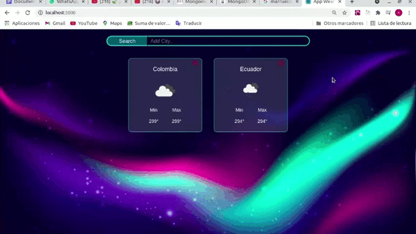

# APP WEATHER

#### Esta aplicacion esta realizada usando la API 'Spire Weather' ,  se hace uso de React, en ella podes buscar el clima de cada pais y cuidad por nombre, esto te traera la temperatura maxima y minima, si quieres ver mas detalles como la velocidad del viendo o humedad solo debes de dar click sobre el nombre y te redirigira a sus detalles, tambien podes eliminarlas de tu home si ya no la necesitas
 
 

### Wed

* #### Probala tu mismo: https://myappweathers.netlify.app/
 
 

### CLONAR REPOSITORIO

* #### $ git clone https://github.com/andreajhl/AppWeather.git
 
 

### PROBAR

### Después de clonar este repositorio.

* #### Ingresar a la carpeta del proyecto desde tu editor de codigo favorito.
* #### Abre la consola del proyecto
* #### En la terminal del proyecto ejecute la línea de comando, 'npm install'
* #### Al culminar la instalacion ejecute 'npm start' para arrancar el proyecto.
 
 

### TECNOLOGIAS USADAS

* #### HTML5
* #### SASS
* #### Javascript
* #### ReactJS
 
 

### PANTALLAS DEL PROYECTO Y USOS

* ### Home
 

#### Aca aparecen las tarjetas de las cuidades o paises que vayas buscando; Esto lo podes hacer desde la barra de busqueda como se muestra en el ejemplo
 

 
 

#### En caso de que busques una cuidad que no exista en la api te saldra una alerta
 

 
 

* ### Detalles de cada tarjeta
 

#### Al dar clikc en la tarjeta te saldran detalles adicionales del clima del pais o cuidad
 

 
 

* ### Eliminar tarjeta
 

#### Por ultimo, cuando ya no necesites la informacion podes eliminar la tarjeta con un simple clikc, igualemente podes volver a pedirla mas adelante si la necesitas nuevamente 
 

